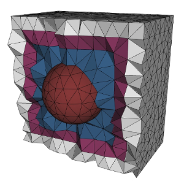

DGTD is a **fast**, **large-scale**, **high-precision** numerical simulation software for electromagnetic problems. DGTD is designed to solve the most common types of scattering problem, radiation problem and waveguide problem. DGTD is now in the state of new release, the relevant agencies are welcome to test the functions of DGTD.

## Features

* High Precision for Complex Structure Objects [Details].
* Structured-Unstructured Hybrid Mesh Technology [Details](features.md#wide-range-of-mesh-types).
* Distributed High Performance Computing [Details](features.md#wide-range-of-mesh-types).
* Be Suitable for Scattering, Radiation, Waveguide Problems [Details](examples.md?amr).
* Peculiar Inhomogeneous Wave Port Solver [Details](http://computation.llnl.gov/blast/parallel-performance).
* Local Time Step and Explicit-Implicit Scheme Technology [Details](features.md).

## News

Date         | Message
------------ | -----------------------------------------------------------------
Jun 15, 2018 | Critical updates with Version 2.0 [Details](https://github.com/mfem/mfem/blob/v3.4/CHANGELOG).
Jun 10, 2018 | SPPS is avaible in DGTD [Details](https://github.com/openhpc/ohpc/releases/tag/v1.3.4.GA).
Jun  8, 2018 | DGTD Version 1.2 [Released](https://str.llnl.gov/2018-01/lee).
Jun  1, 2018 | DGTD Version 1.0 [Published](https://github.com/mfem/mfem/blob/v3.3.2/CHANGELOG).

## Latest Release

[New features](https://github.com/mfem/mfem/blob/v3.4/CHANGELOG)
┊ [Examples](examples.md)
┊ [Documentation](http://mfem.github.io/doxygen/html/index.html)

[<button type="button" class="btn btn-success">
**Download DGTD Version 1.0**
</button>](https://goo.gl/Cq4f4Z)

For older releases see the [download](download.md) section.

## User Guide

[Install for Linux](building.md)
┊ [Install for Windows](serial-tutorial.md)
┊ [Parallel Guide](parallel-tutorial.md)

[Scattering Application](fem.md)
┊ [Radiation Application](electromagnetics.md)
┊ [Waveguide Application](meshing.md)

More details and functions are referenced to the [Manual Documentation]().

## Contact

E-mail: birdchen207@gamil.com  
Phone : +8618752126351  
Adress: There is adress

